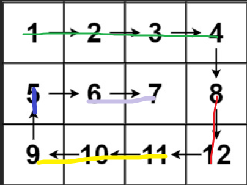

给你一个 m 行 n 列的矩阵 matrix ，请按照 顺时针螺旋顺序 ，返回矩阵中的所有元素。

示例 1：
输入：matrix = \[[1,2,3],[4,5,6],[7,8,9]]
输出：\[1,2,3,6,9,8,7,4,5]

示例 2：
输入：matrix = \[[1,2,3,4],[5,6,7,8],[9,10,11,12]]
输出：\[1,2,3,4,8,12,11,10,9,5,6,7]

提示：
m == matrix.length
n == matrix\[i].length
1 <= m, n <= 10
-100 <= matrix\[i][j] <= 100

### 反思

其实就是每次把第一行弹出，然后把最后一列弹出，然后第二次时就把最后一行弹出，把第一列弹出，以此类推，直到矩阵为空即可，不过我感觉我的方法不是很好

这个大佬的[方法](https://leetcode.cn/problems/spiral-matrix/solutions/2966229/liang-chong-fang-fa-jian-ji-gao-xiao-pyt-4wzk)效率要比我的高不少，不过也比较复杂，还是得多学
